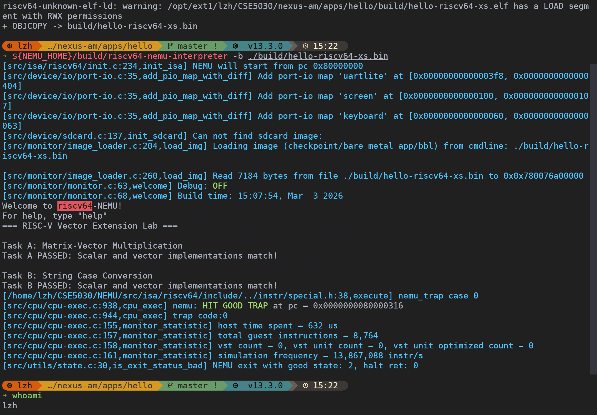

# Lab 10: RISC-V Vector ISA Lab

> ID：12532588
> NAME：Li Zihao

## 1. Question 1: Vector Registers and `vl`

### 1.1 源码文件或函数

- `src/isa/riscv64/instr/rvv/vreg.h`
  - `vreg_ll`
  - `vreg_l`
  - `vreg_i`
  - `vreg_s`
  - `vreg_b`
- `src/isa/riscv64/instr/rvv/vreg_impl.c`
  - `get_vreg`
  - `set_vreg`
  - `get_vreg_with_addr`
- `src/isa/riscv64/local-include/csr.h`
  - vector CSRs：`vstart`、`vl`、`vtype`、`vlenb`
- `src/isa/riscv64/instr/rvv/vcfg.h`
  - `vsetvl`
  - `vsetvli`
  - `vsetivli`
- `src/isa/riscv64/instr/rvv/vcommon.c`
  - `set_vtype_vl`
  - `check_vstart_ignore`
- `src/isa/riscv64/instr/rvv/vcompute_impl.c`
  - arithmetic / reduction / permutation 等 RVV 指令执行循环，循环范围从 `vstart->val` 到 `vl->val`

### 1.2 解释

NEMU 把 vector register 数据保存在 `cpu.vr` 里。`vreg.h` 中的宏用不同元素宽度访问同一组 vector register 存储：`vreg_b` 访问 8-bit 元素，`vreg_s` 访问 16-bit 元素，`vreg_i` 访问 32-bit 元素，`vreg_l` 访问 64-bit 元素。`vreg_impl.c` 再通过 `get_vreg` 和 `set_vreg`，按照当前 `vsew` 和 `vlmul` 读写某一个逻辑 vector element。

`vl` 是一个 vector CSR。`vsetvl` / `vsetvli` / `vsetivli` 会调用 `set_vtype_vl`，而 `set_vtype_vl` 会同时写入 `vtype->val` 和 `vl->val`。如果请求的 vector type 非法，NEMU 会把 `vtype` 设置成 illegal 状态，并把 `vl` 清成 `0`。

RVV 指令执行时，`vl` 决定实际处理多少个 active element。例如 `vcompute_impl.c` 中多处使用 `for (idx = vstart->val; idx < vl->val; idx++)` 这种循环。因此，一条 RVV 指令不会自动处理 vector register 里的所有物理元素，而是只处理从 `vstart` 到 `vl - 1` 的 lane。`vl` 之后的元素属于 tail elements，行为由 `vta` 等 tail policy 控制。

## 2. Question 2: Vector Masks

### 2.1 源码文件或函数

- `src/isa/riscv64/instr/rvv/decode.h`
  - `s->vm = s->isa.instr.v_opv.v_vm`
  - 注释：`1 for without mask; 0 for with mask`
- `src/isa/riscv64/instr/rvv/vreg_impl.c`
  - `get_mask`
  - `set_mask`
- `src/isa/riscv64/instr/rvv/vcompute_impl.c`
  - arithmetic / floating / reduction 等执行循环中检查 `s->vm`、`get_mask(0, idx)` 和 `mask == 0`
  - `mask_instr`
- `src/isa/riscv64/instr/rvv/vldst_impl.c`
  - `vld`、`vst`、`vldx`、`vstx` 中的 vector load/store mask 处理

### 2.2 NEMU 中 masked 和 unmasked operation 的区别

在 NEMU 中，`s->vm` 来自 RVV 指令解码结果。`decode.h` 的注释直接说明：`s->vm = 1` 表示 without mask，`s->vm = 0` 表示 with mask。

真正的 mask bit 存在 vector register `v0` 里。`get_mask(0, idx)` 从 `cpu.vr[0]` 中读取 lane `idx` 对应的 bit，`set_mask` 则把 mask 结果写回某个 vector register。

对于 unmasked operation，`s->vm == 1`，指令不会用 `v0` 过滤 lane。因此 `vstart <= idx < vl` 范围内的所有 active lane 都会执行。

对于 masked operation，`s->vm == 0`，NEMU 会对每个 lane 读取 `get_mask(0, idx)`。如果 mask bit 是 `0`，很多 RVV compute 路径会用 `continue` 跳过这个 lane，或者在 `RVV_AGNOSTIC` 和 `vtype->vma` 允许时写入 agnostic value。对于 vector load/store，`vldst_impl.c` 也会检查 `s->vm == 0 && mask == 0`，然后跳过该 lane 的 memory access。所以关键区别是：unmasked operation 作用于所有 active lane，而 masked operation 只作用于 `v0` mask bit 为真的 lane。

## 3. Question 3: Strided or Indexed Vector Memory Access

### 3.1 源码文件或函数

- `src/isa/riscv64/instr/rvv/vldst.h`
  - `vlse`
  - `vsse`
  - `vlxe`
  - `vsxe`
  - `vlse_mmu`
  - `vsse_mmu`
  - `vlxe_mmu`
  - `vsxe_mmu`
- `src/isa/riscv64/instr/rvv/vldst_impl.c`
  - `vld`
  - `vst`
  - `vldx`
  - `vstx`

### 3.2 为什么这些访问模式适合 data-level parallelism

`vldst.h` 把 strided load/store 指令映射到 `vld(s, MODE_STRIDED, ...)` 和 `vst(s, MODE_STRIDED, ...)`。在 `vldst_impl.c` 中，strided access 会读取 `stride = id_src2->val`，然后按 `base_addr + idx * stride + ...` 这样的形式计算地址。这表示 lane `idx` 可以按照固定间隔访问内存。

Indexed access 由 `vldx` 和 `vstx` 处理。在这些函数中，NEMU 先用 `get_vreg(id_src2->reg, idx, ...)` 从 vector register 里读取当前 lane 的 index，然后按 `base_addr + index + ...` 这样的形式计算地址。这表示每个 lane 都可以使用不同 offset。

这些访问模式适合 data-level parallelism，因为真实数据并不总是连续存放。Strided access 可以处理 row-major matrix 中的一列、array of structs 里的某个字段，或者每隔 `k` 个元素取一次的数据。Indexed access 可以表达 gather/scatter 风格的操作，也就是每个 lane 从不同位置 load，或 store 到不同位置。RVV 仍然可以把这些行为表示成一条 vector instruction，而 NEMU 会按照 `vl`、mask、stride 或 index 逐 lane 展开执行。

## 4. Source Exploration Record

### 4.1 花费时间

源码探索总耗时约 `20-25` 分钟。主要过程是先搜索 RVV 相关关键词，再人工核对 `src/isa/riscv64/instr/rvv/` 下的实现，以及相关 CSR / vector-register 头文件。

### 4.2 AI 工具使用记录

- Tool name and model used：`OpenAI Codex`，GPT-5 based coding agent。
- Prompts or questions submitted：我要求 Codex 按 `todo.md` 从 Step 8 继续，带我探索 NEMU 中 RVV 的实现。
- What the AI tool helped find：AI 帮我把搜索范围收敛到 `src/isa/riscv64/instr/rvv/`，尤其是 `vreg_impl.c`、`vcommon.c`、`vcfg.h`、`decode.h`、`vcompute_impl.c`、`vldst.h` 和 `vldst_impl.c`。
- What I verified manually in the NEMU source code：我人工核对了 vector register 通过 `cpu.vr` 访问，`vl` 由 `set_vtype_vl` 写入，普通 vector 执行循环以 `vl->val` 为上界，`s->vm` 区分 masked 和 unmasked operation，mask bit 来自 `v0`，strided/indexed memory instruction 分别使用 `idx * stride` 或从 vector register 读取的 per-lane index 计算地址。
- Mistakes, limitations, or useful lessons：一开始直接搜索 `mask` 和 `index` 会返回很多 MMU、trigger 和非 RVV 代码中的无关结果。更有效的做法是第一轮搜索后把范围限制到 `src/isa/riscv64/instr/rvv/`，再把每个答案都落到具体文件和函数上。

## 5. Question 4: Completed `hello.c` and RVV Intrinsics

### 5.1 Submitted File

- `hello.c`: `/home/lzh/CSE5030/lab10/hello.c`

### 5.2 Intrinsics Used

- Load：`__riscv_vle32_v_i32m1` 用于加载 matrix row 和 vector `x`，`__riscv_vle8_v_u8m1` 用于加载字符串中的字符。
- Multiply：`__riscv_vmul_vv_i32m1` 用于对 `A[i]` 和 `x` 做 32-bit integer vector multiply。
- Reduction：`__riscv_vredsum_vs_i32m1_i32m1` 用于把乘法结果向量归约成一个 sum，`__riscv_vmv_x_s_i32m1_i32` 用于取出 scalar sum。
- Comparison：`__riscv_vmsgeu_vx_u8m1_b8` 和 `__riscv_vmsleu_vx_u8m1_b8` 分别生成 `c >= 'a'` 和 `c <= 'z'` 的 mask，`__riscv_vmand_mm_b8` 把两个 mask 合成 lowercase mask。
- Masked update：`__riscv_vsub_vx_u8m1` 先生成 `c - 32` 的 uppercase candidate，`__riscv_vmerge_vvm_u8m1` 再按 lowercase mask 选择更新后的字符或原字符，最终只更新 mask 为真的 lowercase lane。
- Store：`__riscv_vse8_v_u8m1` 用于把转换后的字符写回字符串。

## 6. Question 5: Successful NEMU Execution Screenshot

## 7. Question 6: Scalar vs Vector String Conversion

Scalar 版本逐字符执行 `if (str[i] >= 'a' && str[i] <= 'z')`，每个字符都要经过 branch 判断。字符是小写时减 `32`，不是小写时保持原值。

Vector 版本一次加载多个 `uint8` 字符到 vector register。它不是为每个字符写一个 `if`，而是用两个 vector comparison 生成 mask：一个判断 `c >= 'a'`，另一个判断 `c <= 'z'`，再用 `vmand` 得到 lowercase mask。

当前实现使用 `vsub + vmerge` 完成 masked update：先计算 uppercase candidate，再按 lowercase mask 选择写回值。mask 为真的小写字母 lane 取 `c - 32`，mask 为假的 lane 保留原字符，因此避免了逐字符 branch，同时保证非小写字符不会被错误修改。
