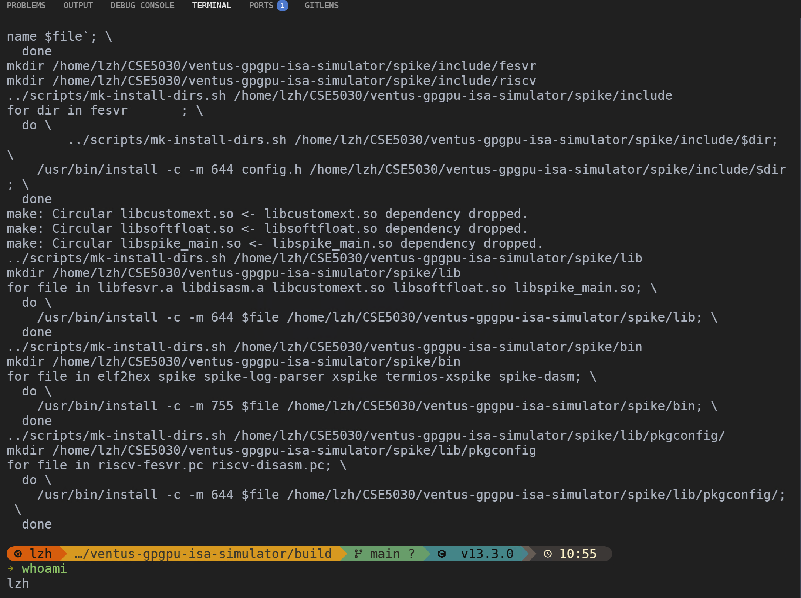
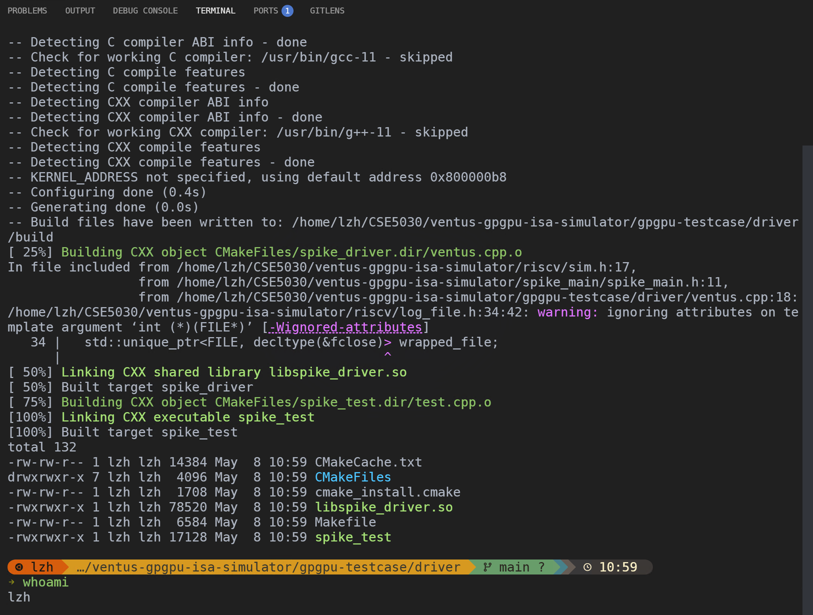
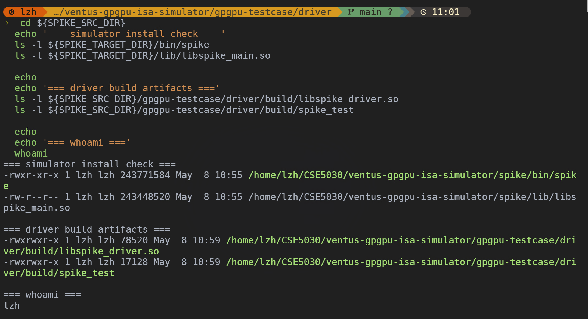
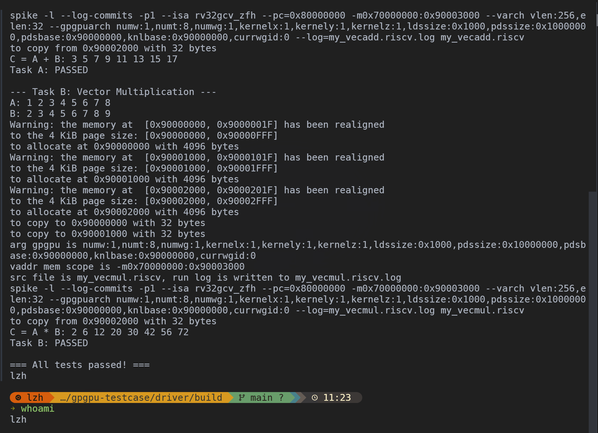

# Lab 11: Ventus GPGPU Driver Lab

> ID：12532588
> NAME：Li Zihao

## 1. Question 1: Build the Simulator and Driver

### 1.1 Screenshot Evidence







## 2. Question 2: Standard Ventus Driver API Flow

### 2.1 The Eight Steps

1. `vt_dev_open`
   - What the API does: 在 host 端创建一个 `vt_device_h` 设备句柄，后续所有内存分配、数据传输和 kernel 启动都通过这个句柄完成。
   - What happens at the hardware/simulator level: `ventus.cpp` 里 `vt_dev_open` 直接 `new spike_device()`。`spike_device` 构造函数会先建立模拟器侧的常驻内存区域，包括从 `0x70000000` 开始的常量/本地共享区和另一块 PC source memory，因此这一步本质上是在初始化一个可运行的 Spike-based GPGPU device context，而不是只返回一个空指针。
2. `vt_buf_alloc` for device buffers
   - What the API does: 为 kernel 运行要用到的设备缓冲区分配地址，例如输入向量、输出向量、metadata buffer、buffer-base table，以及可能的 private memory。
   - What happens at the hardware/simulator level: `vt_buf_alloc` 调到 `spike_device::alloc_local_mem`。源码里本地设备内存从 `ARGBASEADDR = 0x90000000` 开始，按页对齐顺序往后分配；每次分配都会在模拟器内部登记一段 `mem_cfg_t(base, size)`，并分配对应的 `mem_t` 作为这段设备内存的真实后端存储。因此这一步不是“记个地址”而已，而是在模拟器里真的创建了一块可读写的设备内存对象。
3. `vt_copy_to_dev` for input data
   - What the API does: 把 host 端准备好的输入数组复制到刚才分配的设备地址里，例如 `A`、`B` 两个输入向量。
   - What happens at the hardware/simulator level: `vt_copy_to_dev` 调到 `spike_device::copy_to_dev`，后者按目标虚拟地址找到所属 buffer，然后调用 `mem_t::store(...)` 把字节真正写进该设备内存对象。也就是说，这一步完成后，kernel 之后从 `0x90000000` 一带加载到的数据，已经不是 host 数组，而是模拟器里那份被写入后的 device memory。
4. `vt_copy_to_dev` for runtime metadata
   - What the API does: 把运行时辅助数据复制到设备内存，例如 metadata buffer、本次 kernel 的参数表、buffer base 地址表等。
   - What happens at the hardware/simulator level: 这一步和输入数据复制用的是同一个 API，但语义不同。输入向量是“算术操作的数据”，而 metadata/buffer table 是“驱动告诉设备如何解释这次执行”的控制信息。源码中的 `test.cpp` 就先分配 `vaddr_3` 和 `vaddr_4`，再把 metadata 和 buffer base 表写进设备内存，随后 `meta.metaDataBaseAddr` 指向这块 metadata buffer，供模拟器启动 kernel 时读取。
5. `vt_upload_kernel_file`
   - What the API does: 向 driver 指定本次要运行的 `.riscv` kernel 文件，例如 `vecadd.riscv` 或你后续写的 `my_vecadd.riscv`。
   - What happens at the hardware/simulator level: 这一步在当前实现里并没有立即把 ELF 文件内容拷进某块 `mem_t`。`ventus.cpp` 里的 `vt_upload_kernel_file` 只调用了 `spike_device::set_filename(filename)`，把源文件名和日志文件名记录下来。真正把 kernel 作为 Spike 的待执行程序装入模拟器，是在 `vt_start -> spike_device::run(...)` 里完成的。所以从源码看，它更像“登记即将运行的 kernel 文件”，而不是“立刻 DMA 上传二进制”。
6. `vt_start`
   - What the API does: 根据 `meta_data` 启动一次 kernel 执行。
   - What happens at the hardware/simulator level: `vt_start` 把 `metaData` 强转成 `meta_data*`，然后调用 `device->run(knl_data, 0x80000000)`。`spike_device::run` 会从 `meta_data` 中取出 `wf_size`、`wg_size`、`kernel_size[3]`、`ldsSize`、`pdsBaseAddr`、`metaDataBaseAddr` 等字段，生成 Spike 启动参数，包括 `--pc=0x80000000`、`--varch vlen:wf_size*32,elen:32` 和 `--gpgpuarch ... knlbase:metaDataBaseAddr ...`，再创建 `sim_t` 并调用 `sim->run()`。因此这一步本质上是“按当前 metadata 把 Spike 配置成一次 GPU 风格启动，然后把 kernel 从入口 PC 开始跑起来”。
7. `vt_copy_from_dev`
   - What the API does: 在 kernel 结束后，把结果从设备内存复制回 host 内存，供 C++ 程序检查输出是否正确。
   - What happens at the hardware/simulator level: `vt_copy_from_dev` 调到 `spike_device::copy_from_dev`，后者根据设备地址定位对应的 `mem_t`，再通过 `mem_t::load(...)` 把内容读回到 host 提供的缓冲区。因此这一步不是重新计算，而是把 kernel 已经写在设备内存里的结果取回主机侧。
8. `vt_buf_free`
   - What the API does: 释放本次运行使用的设备缓冲区，为下一次 kernel 运行重置分配状态。
   - What happens at the hardware/simulator level: 当前实现里的 `vt_buf_free` 直接调用 `spike_device::free_local_mem()`，会清空整个 `buffer` 和 `buffer_data`，也就是一次性释放所有通过 `alloc_local_mem` 分配的本地设备内存对象，而不是只按某个单独地址精确释放一块。因此在这个 lab 里，它更像“重置当前这轮所有 device-side local allocations”。

## 3. Question 3: `meta_data` Explanation

### 3.1 `wf_size` vs `wg_size`

- Meaning of `wf_size`: `wf_size` 表示 `threads per warp`。从 `spike_main/spike_main.h` 和 `driver/test.cpp` 的注释可以直接看出，它描述的是“一个 warp 里有多少 thread”。在当前实现里，`spike_device::run` 会把 `wf_size` 读成 `num_thread = knl_data->wf_size`。
- Meaning of `wg_size`: `wg_size` 表示 `warps per workgroup`。同样从结构体注释可见，它描述的是“一个 workgroup 里有多少个 warp”。在当前实现里，`spike_device::run` 会把 `wg_size` 读成 `num_warp = knl_data->wg_size`。
- Difference between them: 两者描述的不是同一层级。`wf_size` 决定单个 warp 内部的 thread 数量，`wg_size` 决定一个 workgroup 由多少个 warp 组成，因此它们的关系是 `thread < warp < workgroup`。在 `test.cpp` 的默认配置里，`num_thread = 8`、`num_warp = 4`，也就是“每个 warp 8 个线程，每个 workgroup 4 个 warp”。
- Why `VLEN = wf_size × 32`: 当前实现中 `spike_device::run` 明确生成 `--varch` 参数为 `vlen:num_thread*32,elen:32`，其中 `num_thread` 就是 `wf_size`。因此向量长度 `VLEN` 是按“每个线程对应一个 32-bit lane”来构造的，结果就是 `VLEN = wf_size × 32`。例如 `wf_size = 8` 时，driver 实际传给 Spike 的就是 `vlen:256,elen:32`。

### 3.2 `ldsSize` and `pdsSize`

- Role of `ldsSize` in the GPU memory hierarchy: `ldsSize` 表示每个 workgroup 使用的 `local data share` 大小，也就是 workgroup 内部共享的小块本地存储空间。`spike_main.h` 的注释已经写明它是 “每个workgroup使用的local memory的大小”。在 `spike_device::run` 里，这个值被读成 `ldssize`，并进一步编码进 `--gpgpuarch` 参数传给模拟器，因此它直接参与定义 workgroup 可见的共享存储资源。
- Role of `pdsSize` in the GPU memory hierarchy: `pdsSize` 表示每个 thread 使用的 `private data share` 大小，也就是每个 thread 自己独占的私有存储需求。结构体注释直接写了 “每个thread用到的private memory大小”。从概念上说，它对应的是比 `lds` 更私有的一层存储，用来表示线程私有工作空间。
- Why they matter for kernel execution: 这两个字段之所以重要，是因为它们告诉模拟器“这次 kernel 运行需要多少共享存储和多少私有存储”。具体到当前源码，`ldsSize` 被真实读入并传给 `--gpgpuarch`；`pdsSize` 在 `test.cpp` 里先用于计算 private memory 的分配大小 `pdssize * num_thread * num_warp * num_workgroup`，说明 driver 侧确实把它当成“每线程私有空间需求”来估算总容量。不过在 `spike_device::run` 的当前实现里，`pdssize` 又被临时写死成 `0x10000000`，也就是说：从设计意图上 `pdsSize` 是元数据的一部分，但在当前代码版本中它还没有像 `ldsSize` 那样被完整贯彻到底层执行配置。

### 3.3 `metaDataBaseAddr` and `pdsBaseAddr`

- Why `metaDataBaseAddr` points to a metadata buffer in device memory: 在 `driver/test.cpp` 里，程序先用 `vt_buf_alloc` 分配 `vaddr_3` 作为 metadata buffer，再用 `vt_copy_to_dev(p, vaddr_3, data_2, 14*4, ...)` 把 14 个字的 metadata 写进去，随后执行 `meta.metaDataBaseAddr = vaddr_3`。这说明 `metaDataBaseAddr` 不是随便填的常数，而是专门指向一块已经位于 device memory 中、并且已经被 host 填好控制信息的 metadata buffer。当前实现中这块 buffer 里至少包含 kernel 入口、buffer base 表地址、workgroup 尺寸和打印缓冲区信息。
- Why it is used together with `pdsBaseAddr`: 两者配合，是因为模拟器启动 kernel 时既需要知道“控制信息放在哪”，也需要知道“线程私有内存从哪开始”。在 `test.cpp` 中，`pdsbase` 先按 `pdssize * num_thread * num_warp * num_workgroup` 分配，再写回 `meta.pdsBaseAddr = pdsbase`；而 `metaDataBaseAddr` 则指向 metadata buffer。所以这两个字段分别充当两个不同地址入口：一个入口给 metadata，一个入口给 private memory。
- How these addresses help the simulator start the kernel: `spike_device::run` 会把 `metaDataBaseAddr` 读成 `knlbase`，把 `pdsBaseAddr` 读成 `pdsbase`，再把它们都编码进 `--gpgpuarch` 字符串：`... pdssize:..., pdsbase:0x..., knlbase:0x...`。也就是说，这两个地址不会留在 host 侧无用，而是会被 driver 转换成 Spike 启动参数，告诉模拟器“控制元数据在 device memory 的哪里”“私有数据区在 device memory 的哪里”。没有这两个地址，模拟器就不知道该去什么位置读取 kernel 运行时控制信息，也不知道 thread-private 存储应该映射到哪里。

## 4. Source Exploration Record

### 4.1 Time Spent

- Total time spent on source exploration: 约 `25-30` 分钟。主要用于阅读 `driver/include/ventus.h`、`driver/ventus.cpp`、`driver/test.cpp`、`spike_main/spike_main.h` 和 `spike_main/spike_device.cc`，确认 `Q2` 与 `Q3` 中 API 和 `meta_data` 字段的真实实现行为。

### 4.2 AI Tool Usage

- Tool name: `OpenAI Codex`
- Model used: `GPT-5 based coding agent`
- Prompts or questions submitted:
```
这是我此次 lab 的要求，我英文不太好也没太有计算机基础，需要你做：
1. 把其中涉及的概念做成笔记，让我读了之后就能很好的理解这次lab，写入 note.md，画一个整体ascii流程图；
2. 列出详细的todolist 讲清楚完成这次lab每步需要做什么为什么这么做 指令是什么 指令的含义是什么，写入 todo.md；
3. 做一个report 把要交的内容写入 答案用 TODO 占位 写入report.md；
你可以参考其他lab文件夹的目录格式来完成这些任务
中文模板，英文术语保留
```
### 4.3 What the Tool Helped Find

AI 工具主要帮助我快速缩小了源码阅读范围，并指出了需要重点核对的调用链：

1. `vt_dev_open`、`vt_buf_alloc`、`vt_copy_to_dev`、`vt_upload_kernel_file`、`vt_start`、`vt_copy_from_dev`、`vt_buf_free` 在 `ventus.cpp` 中的实现入口。
2. `meta_data` 在 `spike_main/spike_main.h` 和 `driver/test.cpp` 中的字段定义与默认示例。
3. `spike_device::run` 中 `wf_size`、`wg_size`、`metaDataBaseAddr`、`pdsBaseAddr` 最终如何展开成 `--varch` 和 `--gpgpuarch` 参数。
4. 哪些步骤是真正修改 simulator 内存对象，哪些步骤只是登记状态。例如 `vt_upload_kernel_file` 在当前实现里只是 `set_filename(...)`，不是立即把 ELF 拷进设备内存。

### 4.4 What Was Verified Manually

我手动核对了以下内容：

1. 在 `gpgpu-testcase/driver/include/ventus.h` 中确认 API 原型和官方注释。
2. 在 `gpgpu-testcase/driver/ventus.cpp` 中确认每个 driver API 最终转调到 `spike_device` 的哪个方法。
3. 在 `gpgpu-testcase/driver/test.cpp` 中确认默认示例如何设置：
   - `wf_size = 8`
   - `wg_size = 4`
   - `meta.metaDataBaseAddr = vaddr_3`
   - `meta.pdsBaseAddr = pdsbase`
4. 在 `spike_main/spike_main.h` 中确认 `meta_data` 结构体字段定义和中文注释。
5. 在 `spike_main/spike_device.cc` 中确认：
   - 本地设备内存从 `0x90000000` 一带顺序分配
   - `vt_copy_to_dev` / `vt_copy_from_dev` 分别落到 `mem_t::store` / `mem_t::load`
   - `vt_start` 最终进入 `sim->run()`
   - `VLEN` 实际由 `wf_size * 32` 构造
   - `metaDataBaseAddr` 和 `pdsBaseAddr` 会被编码进 `--gpgpuarch`

### 4.5 Mistakes, Limitations, or Lessons

这次探索有几个比较明确的教训：

1. AI 很适合帮助定位“该看哪些文件”，但不能替代源码核对。例如 `vt_upload_kernel_file` 从函数名看像是“把 kernel 上传到设备内存”，但手动检查 `ventus.cpp` 后才知道当前实现只是记录文件名，真正执行发生在 `vt_start` 之后。
2. 我在探索过程中一度把关键实现文件误判成 `spike_main.cc`，而真实实现其实在 `spike_device.cc`。这说明路径和文件名必须用真实目录验证，不能凭经验猜。
3. 字段的“设计语义”和“当前实现完整度”可能不完全一致。最典型的是 `pdsSize`：从结构定义和 `test.cpp` 看它确实表示 per-thread private memory size，但在 `spike_device::run` 当前版本里，底层 `pdssize` 仍有写死值，因此回答时必须区分“概念层含义”和“当前实现现状”。
4. 本次最有效的工作流不是“直接让 AI 生成答案”，而是“先让 AI 帮我缩小源码阅读范围，再手动核对 `ventus.h`、`ventus.cpp`、`test.cpp`、`spike_device.cc` 后写入报告”。

## 5. Question 4: Completed Kernel and Test Program

### 5.1 Submitted Files

- `my_test.cpp`: `gpgpu-testcase/my_test.cpp`
- `my_vecadd.s`: `gpgpu-testcase/my_vecadd.s`
- `my_vecmul.s`: `gpgpu-testcase/my_vecmul.s`

### 5.2 Screenshot Evidence



### 5.3 API Functions Used and Their Simulator-Level Meaning

1. `vt_dev_open`
   - 打开并初始化一个可复用的 Ventus 设备句柄，在 driver 内部构造 `spike_device`。
2. `vt_buf_alloc`
   - 为输入/输出向量分配设备侧 buffer，在 `0x90000000` 一带建立对应的模拟器内存。
3. `vt_copy_to_dev`
   - 把 host 端数组写到设备 buffer，实际落到模拟器内存对象的写入操作。
4. `vt_upload_kernel_file`
   - 指定当前要运行的 `.riscv` kernel 文件，当前实现里主要是登记文件名供后续启动使用。
5. `vt_start`
   - 按给定 `meta_data` 启动一次 kernel 执行，把执行参数展开给 Spike 并调用 `sim->run()`。
6. `vt_copy_from_dev`
   - 把设备侧结果读回 host 内存，从模拟器内存对象中取回 kernel 输出。
7. `vt_buf_free`
   - 在一轮 kernel 结束后清空当前分配的设备 buffer，使下一轮从干净状态重新分配。

## 6. Question 5: Why the Kernel Writes to `tohost`

### 6.1 Why a Normal `return` Cannot Work

在这次 lab 里，kernel 不是作为一个普通 C/C++ 函数被 host 程序直接调用的，而是作为一个独立的 bare-metal `.riscv` 程序，由 `vt_start -> spike_device::run -> sim->run()` 放到模拟器里从 `0x80000000` 开始执行。也就是说，这里没有一个已经由 host 建好的标准调用栈，也没有操作系统进程退出机制，更没有一个“return 回 host 程序”的常规 ABI 返回路径。

如果 kernel 只执行普通 `return`，本质上只是跳到寄存器里当前保存的返回地址；但在这种 bare-metal GPGPU 执行模型下，这个返回地址并不是一个可靠的“host runtime continuation point”。因此 kernel 结束时不能依赖常规函数返回语义，而必须显式通过 `tohost` 告诉模拟器“本次目标程序已经完成，可以结束 `sim->run()` 了”。

### 6.2 How HTIF Detects and Handles the `tohost` Write

Spike 的 `sim_t` 继承自 `htif_t`，而 `sim_t::run()` 最终直接调用 `htif_t::run()`。在 `htif_t::load_program()` 中，模拟器会从 ELF 符号表里查找 `tohost` 和 `fromhost`；如果两者存在，就把它们的地址保存到 `tohost_addr` 和 `fromhost_addr`。这也是为什么我的 linker script 和汇编代码里必须显式保留：

```text
tohost
fromhost
```

运行过程中，`htif_t::run()` 会反复轮询 `tohost_addr` 指向的内存位置。源码里这段关键逻辑是：

1. 读取 `tohost_addr` 的 64-bit 值
2. 如果读到的值非 `0`
   - 先把该位置清零
   - 再构造 `command_t cmd(mem, tohost, fromhost_callback)`
   - 交给 `device_list.handle_command(cmd)` 处理
3. 同时维护 `fromhost` 队列，必要时把 host 响应写回 `fromhost_addr`

所以从机制上看，kernel 往 `tohost` 写 `1`，就是在向 HTIF 发送一个完成/退出信号；HTIF 看到这个非零值后，就会接管后续处理流程，使 `sim->run()` 能够结束并把控制权返回给 driver。

### 6.3 What Happens If the Kernel Omits the `tohost` Write

如果 kernel 省略了 `tohost` 写入，最直接的后果是 HTIF 看不到任何完成信号。源码里 `htif_t::run()` 的主循环会持续检查 `tohost_addr`，只有读到非零值时才会触发命令处理；否则就继续 `idle()`。更极端的是，如果 ELF 里连 `tohost` / `fromhost` 符号都没有，`htif_t::load_program()` 会打印警告，而 `htif_t::run()` 在发现 `tohost_addr == 0` 后会进入无限 `idle()` 循环。

放到这次实验里，结果就是：

1. kernel 即使已经把结果写回 `C`，driver 也不知道它何时“正式结束”
2. `sim->run()` 不能正常返回
3. `vt_start(...)` 对 host 程序来说会表现成卡住、长时间不结束，或者只能依赖外部超时/人工中断

因此，`tohost` 写入不是装饰性的收尾动作，而是 bare-metal kernel 与 HTIF 之间的正式完成协议。
