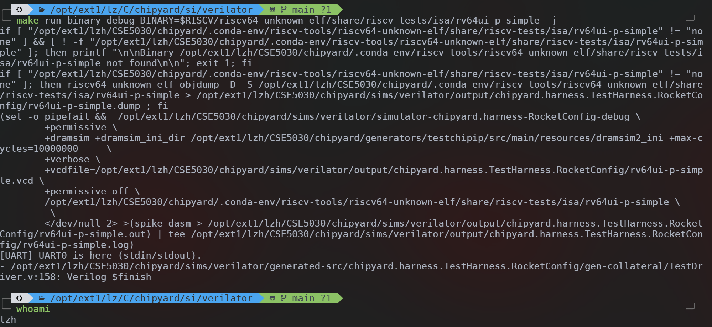
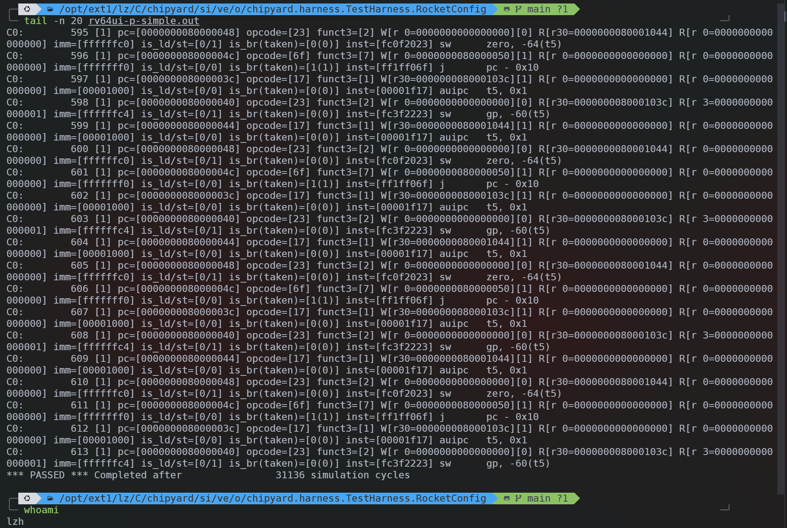
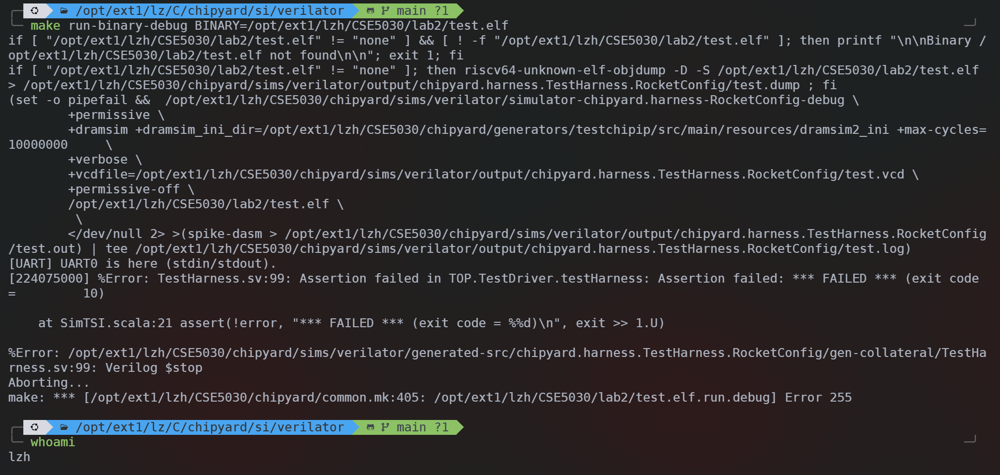
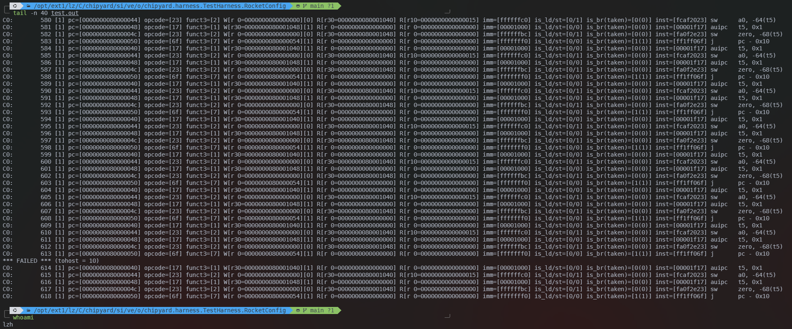
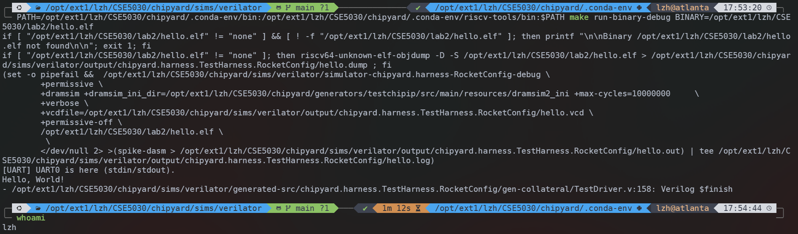

# CSE5030 Lab 2 Report

> 12532588 李子豪

### Step 1.1 启用详细 CPU Trace





### Step 1.2 编写 RISC-V 汇编数组求和程序





### Step 1.3 指令语义分析

#### 普通 ALU 指令：`add t2, t2, t3`

```text
C0:        221 [1] pc=[0000000080000014] opcode=[33] funct3=[0] W[r 7=000000000000000a][1] R[r 7=0000000000000006] R[r28=0000000000000004] imm=[00000007] is_ld/st=[0/0] is_br(taken)=[0(0)] inst=[01c383b3] add     t2, t2, t3
```

该指令的 `ISA` 语义是 `t2 = t2 + t3`。从日志可以看出：

- `pc=[0000000080000014]` 表示该指令位于地址 `0x80000014`
- `opcode=[33]` 表示这是寄存器-寄存器类型的整数运算指令
- `funct3=[0]` 对应 `add`
- `R[r 7=0000000000000006]` 表示源寄存器 `t2` 原值为 `6`
- `R[r28=0000000000000004]` 表示源寄存器 `t3` 的值为 `4`
- `W[r 7=000000000000000a][1]` 表示执行后将结果 `10` 写回寄存器 `t2`
- `is_ld/st=[0/0]` 说明该指令不访问内存
- `is_br(taken)=[0(0)]` 说明该指令不改变控制流

#### 带立即数的 ALU 指令：`addi t1, t1, -1`

```text
C0:        223 [1] pc=[000000008000001c] opcode=[13] funct3=[0] W[r 6=0000000000000000][1] R[r 6=0000000000000001] R[r 0=0000000000000000] imm=[ffffffff] is_ld/st=[0/0] is_br(taken)=[0(0)] inst=[fff30313] addi    t1, t1, -1
```

该指令的 `ISA` 语义是 `t1 = t1 + (-1)`。从日志可以看出：

- `opcode=[13]` 表示这是带立即数的整数运算指令
- `funct3=[0]` 对应 `addi`
- `R[r 6=0000000000000001]` 表示执行前 `t1` 的值为 `1`
- `imm=[ffffffff]` 是符号扩展后的立即数 `-1`
- `W[r 6=0000000000000000][1]` 表示运算结果 `0` 被写回 `t1`
- `is_ld/st=[0/0]` 表示不访问内存
- `is_br(taken)=[0(0)]` 表示不属于分支或跳转

#### 访存指令：`ld t3, 0(t0)`

```text
C0:        219 [1] pc=[0000000080000010] opcode=[03] funct3=[3] W[r28=0000000000000004][1] R[r 5=0000000080002018] R[r 0=0000000000000000] imm=[00000000] is_ld/st=[1/0] is_br(taken)=[0(0)] inst=[0002be03] ld      t3, 0(t0)
```

该指令的 `ISA` 语义是 `t3 = Memory[t0 + 0]`。从日志可以看出：

- `opcode=[03]` 表示这是 `load` 指令
- `funct3=[3]` 对应 `RV64` 中的 `ld`
- `R[r 5=0000000080002018]` 表示基址寄存器 `t0` 的值为 `0x80002018`
- `imm=[00000000]` 表示偏移量为 `0`
- 因此实际访存地址为 `0x80002018 + 0`
- `W[r28=0000000000000004][1]` 表示从该地址读取出的值 `4` 被写入寄存器 `t3`
- `is_ld/st=[1/0]` 说明这是一条 `load` 指令
- `is_br(taken)=[0(0)]` 表示不涉及控制流改变

#### 分支指令：`bnez t1, loop`

```text
C0:        224 [1] pc=[0000000080000020] opcode=[63] funct3=[1] W[r 0=0000000000000000][0] R[r 6=0000000000000000] R[r 0=0000000000000000] imm=[fffffff0] is_ld/st=[0/0] is_br(taken)=[1(0)] inst=[fe0318e3] bnez    t1, pc - 16
```

该指令的 `ISA` 语义是：若 `t1 != 0` 则跳回 `loop`，否则顺序执行下一条指令。从日志可以看出：

- `opcode=[63]` 表示这是分支指令
- `funct3=[1]` 对应 `bne` 条件，`bnez` 是其伪指令形式
- `R[r 6=0000000000000000]` 表示此时 `t1=0`
- `imm=[fffffff0]` 表示分支偏移量为 `-16`
- `W[r 0=...][0]` 表示分支指令不会向通用寄存器写回结果
- `is_ld/st=[0/0]` 表示它不是访存指令
- `is_br(taken)=[1(0)]` 中，第一个 `1` 表示它是一条分支指令，括号中的 `0` 表示这一次分支没有被采取


## Step 2：交叉编译与函数调用分析

### 编译与运行结果



### 汇编代码与调用约定分析

从 `hello.dump` 中摘录函数 `f` 和 `main` 的汇编如下：

```text
0000000080000230 <f>:
    80000230: 1101                 addi    sp,sp,-32
    80000232: ec22                 sd      s0,24(sp)
    80000254: 6462                 ld      s0,24(sp)
    80000256: 6105                 addi    sp,sp,32
    80000258: 8082                 ret

000000008000025a <main>:
    8000025a: 1141                 addi    sp,sp,-16
    8000025c: e406                 sd      ra,8(sp)
    8000025e: e022                 sd      s0,0(sp)
    80000262: 4589                 li      a1,2
    80000264: 4505                 li      a0,1
    80000266: fcbff0ef             jal     80000230 <f>
    8000027a: 60a2                 ld      ra,8(sp)
    8000027c: 6402                 ld      s0,0(sp)
    8000027e: 0141                 addi    sp,sp,16
    80000280: 8082                 ret
```

#### 汇编代码如何实现跳转到函数 `f`

在 `main` 中，先用 `li a1, 2`、`li a0, 1` 将参数放入 `a1` 和 `a0`，随后执行：

```text
jal 80000230 <f>
```

`jal` 会跳转到 `f`，同时把返回地址保存到 `ra`。函数结束后通过 `ret` 返回，因此 `main` 对 `f` 的调用是通过 `jal` 实现的。

#### `f` 的函数序言与结尾中保存和恢复了哪些寄存器

`f` 的序言通过 `addi sp, sp, -32` 分配 `32` 字节栈帧，并用 `sd s0, 24(sp)` 保存 `s0`；结尾通过 `ld s0, 24(sp)` 恢复 `s0`，再回收栈空间并 `ret`。由于 `f` 是叶子函数，因此没有额外保存 `ra`。

#### `main` 的调用点保存和恢复了哪些寄存器

从“调用点”本身看，`jal 80000230 <f>` 前后没有额外单独插入保存/恢复寄存器的指令。编译器把需要保留的寄存器放在 `main` 自己的函数序言和结尾中处理，相关指令是：

```text
sd ra, 8(sp)
sd s0, 0(sp)
```

这说明 `main` 保存了 `ra` 和 `s0`，并在函数结尾用 `ld ra, 8(sp)`、`ld s0, 0(sp)` 恢复它们。其中：

- `ra` 虽然是 caller-saved 寄存器，但 `main` 是非叶子函数，后续要调用 `f` 和 `printf`，因此必须先把自己的返回地址保存起来，否则执行 `jal` 后 `ra` 会被覆盖
- `s0` 是 callee-saved 寄存器，`main` 自己既然使用了它，就需要按调用约定保存和恢复

因此，若严格按题目所说的 “at the function call site in main” 来看，调用点附近额外显式处理的主要是参数放入 `a0`、`a1`，以及 `jal` 把返回地址写入 `ra`；而 `ra`、`s0` 的保存/恢复则体现在 `main` 的函数序言和结尾中，而不是紧贴在 `jal` 前后单独出现。

## 交叉编译工具链分析

### 为什么使用 `riscv64-unknown-elf-gcc` 而不是系统默认 `gcc`

系统默认的 `gcc` 面向宿主机平台，例如 `x86-64 Linux` 或 `ARM Linux`。它生成的程序只能在宿主机环境下运行，不能直接在 `RISC-V` CPU 上执行。

而本实验需要在 `Verilator` 中运行一个 `RISC-V` 裸机程序，因此必须使用面向目标架构的交叉编译器 `riscv64-unknown-elf-gcc`。其中：

- `riscv64` 表示目标架构为 64 位 `RISC-V`
- `unknown` 是厂商字段
- `elf` 表示输出面向裸机环境的 `ELF` 文件

也就是说，这个编译器生成的是可在 `RISC-V` 处理器上运行的机器码，而不是宿主机指令。

### 编译参数分析

Step 1 汇编程序：

- `-static`：表示静态链接；Verilator 运行的是裸机程序，没有动态链接器和共享库装载机制，因此必须把程序运行所需内容都直接放进最终 ELF
- `-march=rv64imafd`：指定目标指令集为 `RV64I+M+A+F+D`；这样汇编和链接阶段都会按 Rocket Core 支持的 `RISC-V` 指令集生成目标代码，避免生成错误架构的指令
- `-mcmodel=medany`：指定代码模型；程序被链接到 `0x80000000` 一类高地址，`medany` 允许编译器/汇编器使用适合这种地址布局的寻址方式，否则位置较高时生成的代码可能无法正确访问符号
- `-fvisibility=hidden`：把默认符号可见性设为 hidden；它不是程序在 Verilator 中运行的核心前提，但可以避免生成不必要的外部可见符号，使裸机单程序的链接结果更收敛
- `-nostdlib`：不链接标准库；Verilator 中没有操作系统提供的常规 C 运行时和系统库，而这个汇编程序本身也不依赖标准库
- `-nostartfiles`：不链接默认启动文件；实验要求入口点就是我们自己写的 `_start`，如果链接默认启动代码，入口和初始化流程就会不符合 bare-metal 场景
- `-T link.ld`：指定自定义链接脚本；必须显式控制 `.text.init`、`.tohost`、`.data` 等段放到实验要求的位置，否则模拟器、程序入口和 `tohost` 通信地址都可能不正确

Step 2 C 程序：

- `-fno-common`：禁止把未初始化的全局符号放进 common 区；这样链接器会更明确地分配和检查符号，适合裸机场景下需要清晰可控的链接结果
- `-fno-builtin-printf`：禁止编译器把 `printf` 当作宿主环境中的内建函数做特殊优化；这样会按工具链提供的裸机 `printf` 实现去生成调用，避免引入对宿主运行时语义的假设
- `-static`：静态链接；因为 Verilator 里没有操作系统负责装载动态库，所以 `hello.elf` 必须是可直接运行的完整裸机程序
- `-o hello.elf`：指定输出文件名；这个选项本身不是 bare-metal 运行机制的一部分，但它明确产物名称，便于后续 `make run-binary-debug BINARY=hello.elf` 直接加载运行
