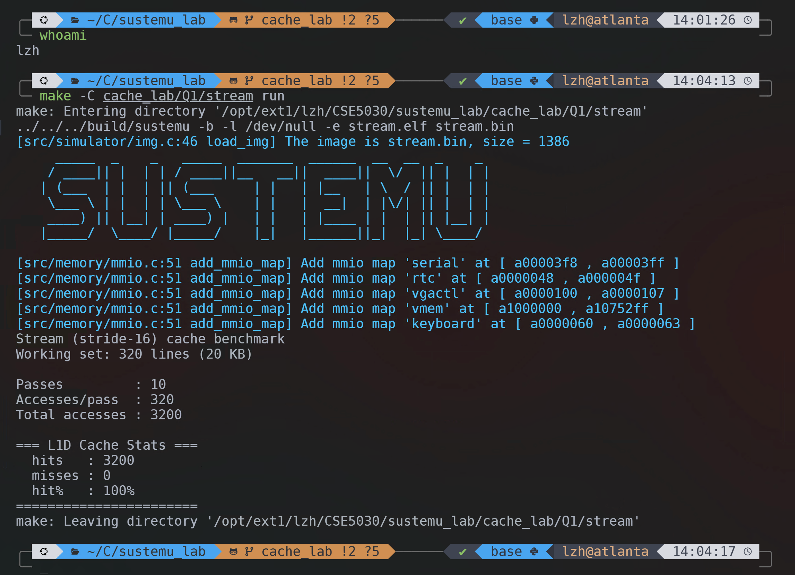

# Lab 3: Cache Report
> 12532588 李子豪

## Step 1 — Environment Setup



---

## Step 2 — L1D Cache Size Sweep

### 实验数据

| L1D_S | L1D Capacity | Hits | Misses | Hit Rate |
|-------|--------------|------|--------|----------|
| 3     | 4 KB         | 0    | 3200   | 0%       |
| 4     | 8 KB         | 0    | 3200   | 0%       |
| 5     | 16 KB        | 0    | 3200   | 0%       |
| 6     | 32 KB        | 3200 | 0      | 100%     |
| 7     | 64 KB        | 3200 | 0      | 100%     |
| 8     | 128 KB       | 3200 | 0      | 100%     |

### 问题回答

**Q: At which L1D_S does the hit rate stop increasing? What does this tell you about the benchmark's working set?**

**A:** 命中率在 **L1D_S = 6**（32 KB）时停止增加，并首次达到 **100%**，这说明该 benchmark 的 working set **大于 16 KB 但不超过 32 KB**，与题目给出的 **20 KB working set** 一致；当缓存容量为 16 KB 及以下时无法容纳完整工作集，因此访问持续 miss，而当 L1D 增大到 32 KB 后工作集可以完整驻留在缓存中，所以命中率达到 100%，继续增大容量也不会再带来收益。

---

## Step 3 — Matrix Multiply

### 问题 1

**Q: What is the L2 hit rate? Given that all three matrices together (192 KB) fit within the 256 KB L2, explain this result.**

**A:** `ijk` 版本的 L2 hit rate 为 **99%**，原因是虽然三个矩阵总大小 `192 KB` 小于 `256 KB` 的 L2 容量，整体上能够放入 L2，但单个矩阵 `64 KB` 已超过 `32 KB` 的 L1D 容量，因此 `ijk` 访存顺序会产生大量 L1D miss；不过这些 miss 大多仍然能在 L2 中命中，所以 L2 hit rate 依然维持在很高水平，少量未命中主要来自首次访问时的 cold miss。


### 实现 cache-friendly loop order

**修改文件：** `cache_lab/Q2/matmul.c`

**实现思路：** 将循环顺序从 `ijk` 改为 `ikj`

```c
for (i = 0; i < N; i++)
    for (k = 0; k < N; k++)
        for (j = 0; j < N; j++)
            C[i][j] += A[i][k] * B[k][j];
```

### 问题 2

| Variant  | L1D hit rate | L1D misses | L2 hit rate |
|----------|--------------|------------|-------------|
| ijk      | 49%          | 2133869    | 99%         |
| reorder  | 97%          | 133249     | 99%         |

**A:** 将循环顺序从 `ijk` 改为 `ikj` 后，`B[k][j]` 在最内层按行连续访问，空间局部性显著改善，因此 L1D hit rate 从 `49%` 提升到 `97%`，L1D misses 从 `2133869` 降到 `133249`；两种顺序的 L2 hit rate 都约为 `99%`，说明 loop reorder 的主要收益是减少 L1D 中由跨行访问带来的大量 miss，而不是改变 L2 的整体命中情况。

---

## Step 4 — Sequential Prefetcher

### 实现 prefetch_hint()

**修改文件：** `src/memory/prefetch.c`

**实现代码：**

```c
paddr_t prefetch_hint(paddr_t addr)
{
    return (addr & ~(BLOCK_SIZE - 1)) + BLOCK_SIZE;
}
```

该实现先用 `addr & ~(BLOCK_SIZE - 1)` 将地址对齐到当前 cache block 起始位置，再加上 `BLOCK_SIZE` 返回下一个 block 的起始地址，从而在发生 L1D miss 时顺序预取后继块。

### 实验结果

| Configuration  | scan1 misses | scan2 misses | 改善 |
|----------------|--------------|--------------|------|
| No prefetch    | 4099         | 4098         | -    |
| Implemented    | **1368**     | **1367**     | **↓ 66.6%** |

**A:** 在没有 prefetch 时，顺序扫描几乎每个 block 的首次访问都会产生 miss，因此 `scan1` 和 `scan2` 的 miss 数都接近 `4096`；实现顺序预取后，访问当前 block 时会提前把下一个 block 载入缓存，使大量原本的 miss 变成 hit，所以 `scan1` misses 降到 `1368`、`scan2` misses 降到 `1367`，整体下降约 **66.6%**，说明该预取器对流式访问模式效果明显。

---
