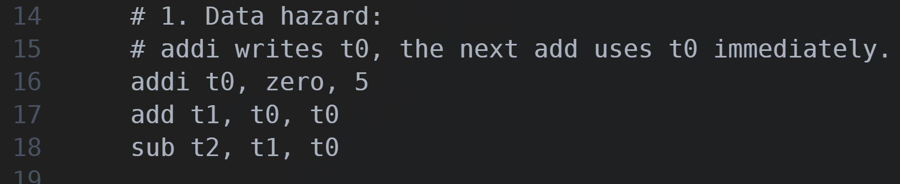
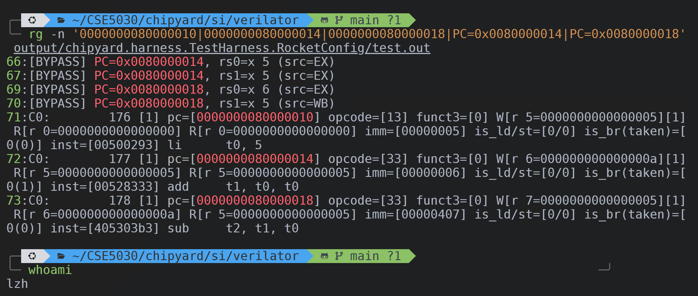
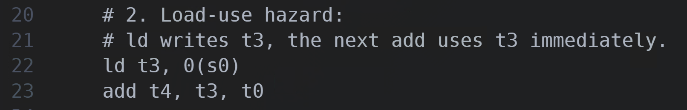
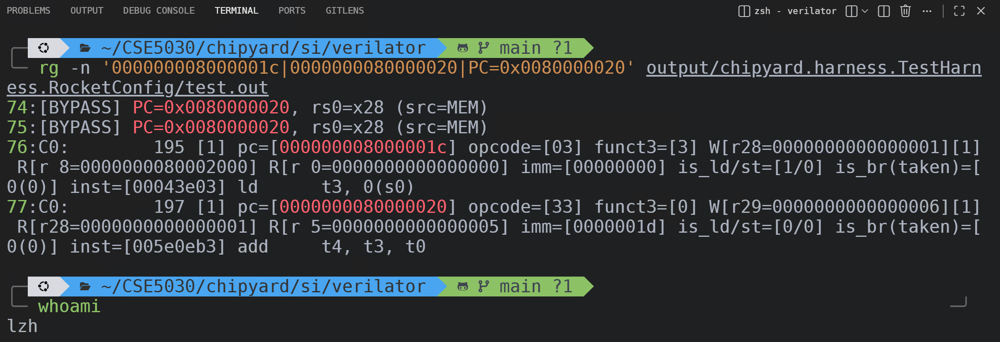
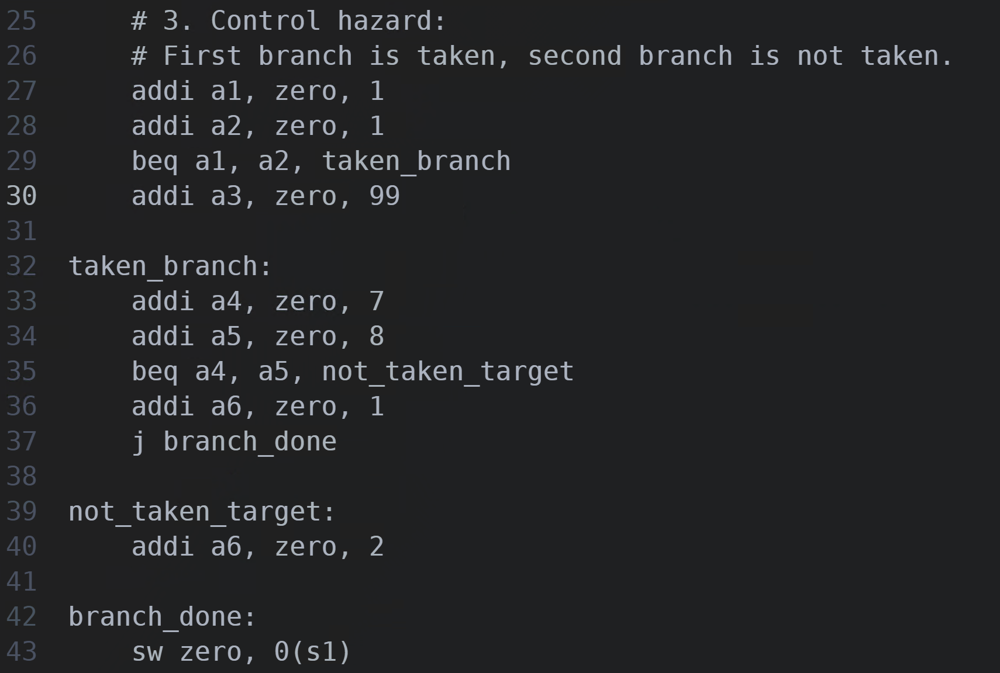
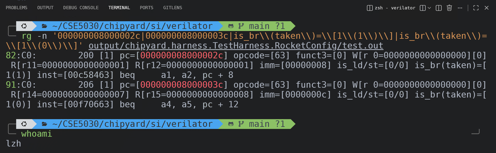

# Lab 4 

> 12532588 李子豪

## 3. 实现结果

### 3.1 Data Hazard

#### 汇编代码

该代码构造了普通 ALU 数据相关：`addi` 先写入 `t0`，后续 `add` 与 `sub` 立即读取相关寄存器，用于观察 bypass 行为。

#### 截图

日志中，`PC=0x0080000014` 出现 `src=EX`，`PC=0x0080000018` 同时出现 `src=EX` 和 `src=WB`。对应的 WB 周期为 `176 -> 177 -> 178`，说明发生了数据旁路，但没有插入 stall。

### 3.2 Load-Use Data Hazard

#### 汇编代码

该代码构造了典型的 load-use 相关：`ld t3, 0(s0)` 从内存读取数据后，下一条 `add t4, t3, t0` 立即使用 `t3`，用于观察是否引入停顿。

#### 截图

日志中，`PC=0x0080000020` 的 bypass 来源是 `MEM`，同时 `ld` 与后续 `add` 的 WB 周期分别为 `195` 和 `197`。这说明 load 结果到更晚的流水段才可用，因此产生了 stall。

### 3.3 Control Hazard

#### 汇编代码

该代码构造了两条前向分支：第一条 `beq a1, a2, taken_branch` 实际 taken，第二条 `beq a4, a5, not_taken_target` 实际 not taken，用于对照观察 control hazard 和默认预测路径。

#### 截图

日志中，`pc=[000000008000002c]` 的 branch 实际 taken，之后进入目标地址 `pc=[0000000080000034]`；`pc=[000000008000003c]` 的 branch 实际 not taken，之后继续执行顺序地址 `pc=[0000000080000040]`。这可用于分析 Rocket 的默认分支预测策略。

## 4. Hazard 分析

### 4.1 Data Hazards

#### 该 hazard 是否导致了 pipeline stall？

没有导致明显的 pipeline stall。

#### 为什么会或不会发生 stall？

因为这组相关属于普通 ALU 指令之间的数据相关，后一条指令需要的结果可以通过 bypass 直接获得，不需要像 load-use hazard 那样等待数据从内存阶段返回。从 WB 日志也可以看到三条相关指令的周期分别是 `C0: 176`、`C0: 177`、`C0: 178`，周期连续，没有插入额外气泡。

#### bypass 来自哪个 pipeline stage？

从日志可见，bypass 主要来自 `EX`，在后续依赖中还出现了 `WB`。

#### 结合指令序列，解释为什么 bypass 来自这个 stage

`addi t0, zero, 5` 在前一条指令中生成 `t0`，紧随其后的 `add t1, t0, t0` 立即读取 `t0`，因此日志中在 `PC=0x0080000014` 出现 `src=EX`。随后 `sub t2, t1, t0` 同时依赖 `t1` 和 `t0`，因此在 `PC=0x0080000018` 可以看到 `EX` 和 `WB` 两种 bypass 来源。

### 4.2 Load-Use Data Hazards

#### 该 hazard 是否导致了 pipeline stall？

导致了 stall。

#### 为什么会或不会发生 stall？

因为 `ld t3, 0(s0)` 的数据不是在 `EX` 阶段立即产生，而是要到更晚的流水段才可用。紧接着的 `add t4, t3, t0` 立刻使用 `t3`，因此这类 `load-use hazard` 会引发等待。

#### 日志中的哪些证据体现了 stall cycles？

从日志可见，`ld` 位于 `pc=[000000008000001c]`，其对应的 WB 周期是 `C0: 195`；紧随其后的 `add` 位于 `pc=[0000000080000020]`，其对应周期是 `C0: 197`。与前面的普通 ALU 相关相比，这里出现了更明显的间隔。同时，bypass 来源为 `MEM`，也说明 load 的结果需要到更晚的流水段才可用。

### 4.3 Control Hazards

#### 默认的 branch prediction policy 是什么？

在 branch history 还没有建立时，Rocket 前端的默认回退策略是 `predict not taken`。

#### 你是如何从日志中判断出来的？

在 Rocket 前端实现中，默认 `predicted_taken := false.B`，即默认先按顺序地址继续取指。再结合两条前向分支日志可以验证这一点：第一条 `beq a1, a2, pc + 8` 实际 taken，但下一条提交的是目标地址上的 `pc=[0000000080000034]`，说明顺序路径被纠正；第二条 `beq a4, a5, pc + 12` 实际 not taken，之后继续执行 `pc=[0000000080000040]` 的顺序指令，与默认 `predict not taken` 一致。

#### taken branch 分析

在 `pc=[000000008000002c]` 的 `beq a1, a2, pc + 8` 中，`a1` 和 `a2` 都被设置为 `1`，因此分支实际发生跳转。日志中的 `is_br(taken)=[1(1)]` 表示这是一条控制流指令，并且这一次 branch 实际被 taken。之后出现的是目标地址上的 `pc=[0000000080000034]`，说明分支最终跳到了目标块。

#### not taken branch 分析

在 `pc=[000000008000003c]` 的 `beq a4, a5, pc + 12` 中，`a4=7`、`a5=8`，因此分支实际不跳转。日志中的 `is_br(taken)=[1(0)]` 表示这是一条控制流指令，但这一次 branch 实际没有 taken。之后继续执行顺序地址上的 `pc=[0000000080000040]`，因此这条分支与默认的 `predict not taken` 路径一致，也是判断默认静态预测策略的关键证据。
