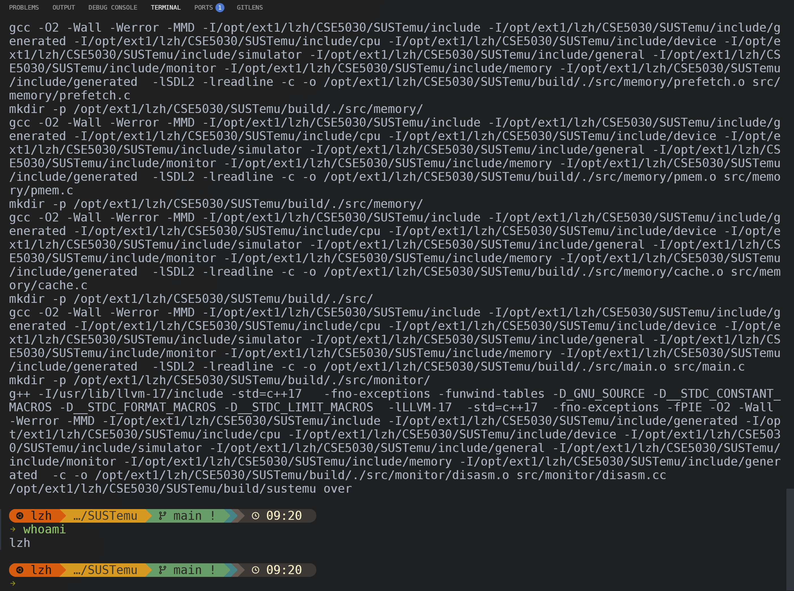

# Lab 5: Out-of-Order Lab

> 学号：12532588
> 姓名：李子豪

## 1. Question 1

### 1.1 Build 截图

## 2. Question 2

### 2.1 Result Table

| Kernel | In-Order IPC | OOO IPC |
| --- | --- | --- |
| serial | 0.99 | 1.16 |
| parallel | 0.99 | 1.74 |

### 2.2 Written Answer

这两个 kernel 每轮都是 7 条指令，但依赖关系不一样。

`kernel_serial` 的关键路径是一条跨迭代的长串行链：`sum -> and -> sll -> add(地址计算) -> ld -> add(sum)`。本轮 `ld` 的地址依赖当前 `sum`，而下一轮又必须等待本轮更新后的 `sum`，所以 OOO 很难提前展开后续迭代，可利用的 ILP 很低。

`kernel_parallel` 则有两条相互独立的累加链：`ld aa[i] -> add sa` 和 `ld bb[i] -> add sb`。两条链之间没有直接数据依赖，OOO 可以在等待一条链结果时推进另一条链，也能更充分利用默认配置中的 `2` 个整数单元和 `2` 个 `LSU`。因此虽然两者每轮都是 `7` 条指令，`kernel_parallel` 在 OOO 模式下的 IPC 明显更高。

所以，`kernel_serial` 的主要限制是长依赖链本身；`kernel_parallel` 的主要限制则不再是单一关键路径，而更接近 `issue width`、执行单元数量和提交带宽。

## 3. Question 3

### 3.1 Result Table

| Benchmark | In-Order Cycles/Iteration | OOO Cycles/Iteration | Theoretical Minimum Cycles/Iteration |
| --- | --- | --- | --- |
| diamond | 9.03 | 6.00 | 6 |
| chain | 9.03 | 7.00 | 7 |

### 3.2 Written Answer

这一步主要看依赖图本身会不会给 OOO 留出并行空间。

`bench_diamond` 的依赖关系是 `ld -> {mul, add+1} -> add -> sd`。`mul` 和 `add+1` 都依赖 `ld`，但二者彼此独立，所以在 `ld` 完成后可以并行发射。按默认延迟 `LAT_L1_HIT=1`、`LAT_INT_ADD=1`、`LAT_INT_MUL=3` 计算，关键路径是 `ld(1) -> mul(3) -> add(1) -> sd(1)`，理论最短为 `6` cycles/iteration。

`bench_chain` 的依赖关系是 `ld -> add+1 -> mul -> add -> sd`，`mul` 必须等待前一条 `add+1`，最后一条 `add` 又必须等待 `mul`，因此是一条更长的串行链。对应理论最短为 `ld(1) -> add(1) -> mul(3) -> add(1) -> sd(1) = 7` cycles/iteration。

实测结果和理论最短值基本对上：`diamond` 是 `6.00`，`chain` 是 `7.00`。这说明当前 OOO 调度器确实能利用 `diamond` 里 `ld` 之后的并行分支；但面对 `chain` 这种纯串行结构时，能做的就很有限，基本只能贴着关键路径往前走。

## 4. Question 4

### 4.1 Result Table

| LAT_L2_HIT | Bench | In-Order CPI | OOO CPI | Speedup |
| --- | --- | --- | --- | --- |
| 8 (default) | parallel | 1.31 | 0.65 | 1.99 |
| 8 (default) | serial | 1.31 | 0.57 | 2.29 |
| 20 | parallel | 1.64 | 0.82 | 2.00 |
| 20 | serial | 1.56 | 0.82 | 1.90 |
| 40 | parallel | 2.20 | 1.10 | 2.00 |
| 40 | serial | 1.98 | 1.10 | 1.80 |

### 4.2 Observation

原始 `memlat` 程序按 `bench_parallel -> bench_serial` 的顺序输出结果。在当前本地代码和分支上，`LAT_L2_HIT=20` 和 `40` 时观察到第二个 benchmark 的 OOO 统计会复用前一个 benchmark 的 `cycles/insts`。为避免这个计数异常，我将测试顺序调整为 `bench_serial -> bench_parallel`，并加入同名预热后重新测量；上表结果以重测数据为准。

## 5. Question 5

### 5.1 Written Answer

从这组实测结果看，OOO 相对 in-order 的 speedup 并不会随着 `LAT_L2_HIT` 无限增长，而是会进入平台区。`bench_parallel` 在 `LAT_L2_HIT=8/20/40` 时分别约为 `1.99x / 2.00x / 2.00x`，已经非常接近收敛到 `2x`；`bench_serial` 在这个分支上的数据则没有继续增长，反而从 `2.29x` 降到 `1.80x`，说明它同样没有出现“延迟越大、加速越大”的无限增长趋势。

决定上限的关键硬件资源是访存并行度，也就是默认配置中的 `LSU units = 2`。对 `bench_parallel` 来说，每轮有两次彼此独立的 load，OOO 基本可以把这两次访存重叠起来，所以 speedup 很自然地稳定在 `2x` 左右。继续增大 L2 命中延迟，只是把两次 load 一起拖慢，不会让可并行的 load 数继续增加。

`bench_serial` 的情况要差一些。它虽然也能靠跨迭代重叠一部分访存，但可挖的并行度没有 `bench_parallel` 那么直接，继续拉高延迟后，还会更容易碰到 `ROB`、`RS`、`issue width=2` 这些资源约束，所以实测 speedup 没有继续上升，反而回落。

因此，这个实验里更合理的结论是：OOO speedup 会收敛，不会无限增长。对 `bench_parallel`，收敛值大致在 `2x`；对 `bench_serial`，当前数据说明它会低于这个上限。
