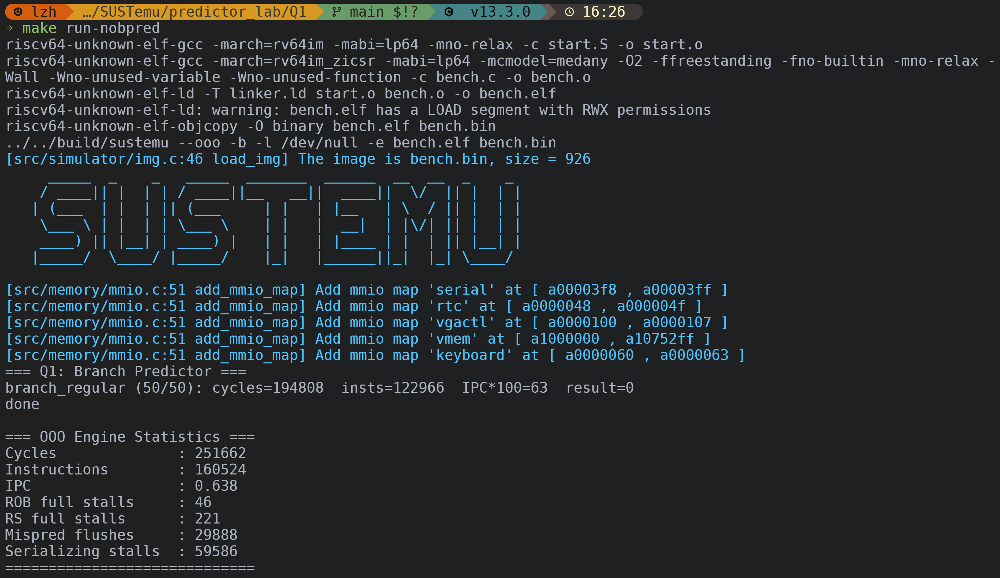
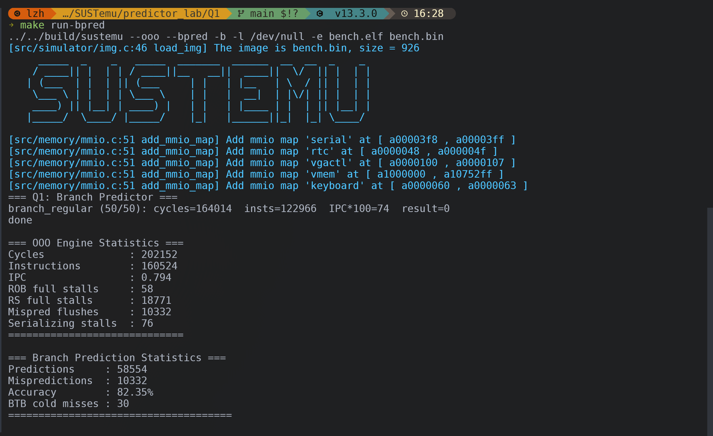
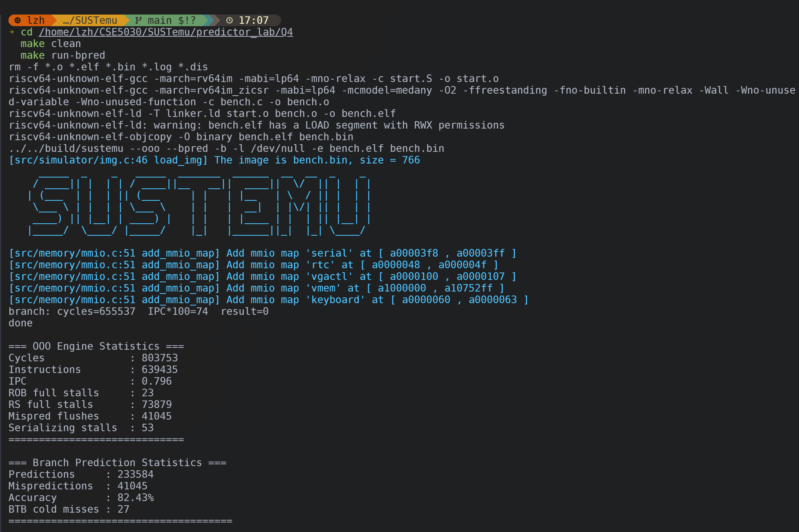
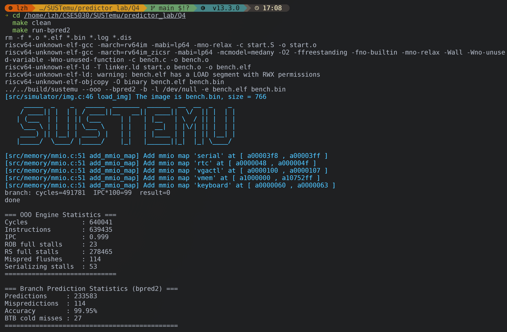

# Lab 5: Branch Predictor Lab

> 学号：12532588
> 姓名：李子豪

## 1. Question 1

### 1.1 `run-nobpred` 截图



### 1.2 `run-bpred` 截图



## 2. Question 2

### 2.1 Result

- 说明：本题 `loop_A` / `loop_B` 的 back-edge 地址、BTB index、`BTB cold misses` 与 `cycles=200040` 都来自保留 `aligned(2048)` 的原始 Q2 版本；下面 Question 3 再对比去掉该对齐属性后的结果。
- `loop_A` back-edge PC = `0x80000820`
- `loop_A` BTB index = `8`
- `loop_B` back-edge PC = `0x80001020`
- `loop_B` BTB index = `8`
- 两个 index 是否冲突：`是`

### 2.2 Written Answer

`loop_A` 和 `loop_B` 的回边分支都会映射到 BTB 的第 `8` 号槽位，因此会发生 BTB aliasing。这里的关键位级原因是：BTB 的 index 使用 `PC[10:2]`，tag 使用 `PC >> 11`；而 `aligned(2048)` 恰好等于 `2^11`，会把函数地址整体推高一个 tag 单位，但不会改变 `PC[10:2]`。因此两个分支会落到同一个 BTB index，却带着不同 tag。当两个循环交替执行时，这个槽位就会被反复互相覆盖。

`BTB tag mismatch` 的代价是：处理器在取指阶段虽然命中了同一个 BTB index，但发现 tag 不匹配后，不能直接使用其中保存的跳转目标地址，只能放弃这次早期目标预测，后续再通过真正执行分支来重定向取指。这样会破坏前端取指连续性，带来额外的重定向开销，并导致较高的 `BTB cold misses`。在保留 `aligned(2048)` 的原始 Q2 版本中，`BTB cold misses` 达到 `8026`，对应 benchmark 输出中的 `cycles=200040`。

## 3. Question 3

### 3.1 Before / After Comparison

| Item | Before removing `aligned(2048)` | After removing `aligned(2048)` |
| --- | --- | --- |
| `loop_B` back-edge PC | `0x80001020` | `0x8000007c` |
| `loop_B` BTB index | `8` | `31` |
| `BTB cold misses` | `8026` | `29` |
| `cycles` | `200040` | `180059` |

### 3.2 Written Answer

去掉 `loop_B` 上的 `aligned(2048)` 之后，`loop_B` 的回边分支地址从 `0x80001020` 变成了 `0x8000007c`，对应的 BTB index 也从 `8` 变成了 `31`。修改前，`aligned(2048)` 把 `loop_B` 推到相隔 `2^11` 的位置，正好满足“tag 变化、index 不变”的条件，所以 `loop_A` 和 `loop_B` 的回边分支都会映射到 BTB 的第 `8` 号槽位，造成严重的 BTB aliasing；修改后，这个人为制造的地址关系消失，`loop_B` 不再落在原来的冲突槽位上，两个循环也不再交替覆盖同一个 BTB entry。

这一变化直接反映在运行结果上：`BTB cold misses` 从 `8026` 大幅下降到 `29`，benchmark 的 `cycles` 也从 `200040` 降到 `180059`。说明之前的性能损失主要不是由程序逻辑本身造成，而是由 `2048` 字节对齐刻意制造出的地址映射冲突造成的。去掉该对齐属性后，aliasing 消失，BTB 能为两个分支分别保留稳定的目标信息，因此性能明显改善。

## 4. Question 4

### 4.1 Result Table

| State | Cycles | Result |
| --- | --- | --- |
| cold | `144` | `32` |
| warm | `80` | `32` |

### 4.2 Written Answer

cold 更慢的原因是预测器刚开始时还没有被训练。根据 `predictor_lab/Q3/bench.c`，程序先通过 `reset_ghr()` 用 `16` 次 always-not-taken 分支把全局历史寄存器清零，然后执行 `probe_branches()` 中的 `32` 条 always-taken 分支。由于初始时相关 `2-bit` 饱和计数器都从偏向 not-taken 的状态开始，第一次执行时会出现较多误预测，因此 cold 的 `cycles` 为 `144`。

经过后续 `8` 轮 warm-up 之后，同一批分支对应的预测表项已经被训练到更适合 always-taken 的状态；同时每次测量前都会再次调用 `reset_ghr()`，保证访问的是同一批 gshare 槽位，因此第二次正式测量时预测更准确，warm 的 `cycles` 降到 `80`。两次 `result` 都是 `32`，说明变化来自预测器训练状态，而不是程序逻辑变化。

## 5. Question 5

### 5.1 `bpred2.c`

本节只在报告中贴出核心实现，详情见源码。

```c
BranchPredictor bpred2_state;
int g_bpred2_mode = 0;

static uint32_t spec_lht[LHT_SIZE];
static const uint32_t LOCAL_HIST_MASK = 0x3;

static inline uint32_t bpred2_pht_index(uint32_t hist, vaddr_t pc) {
    uint32_t hist2 = hist & LOCAL_HIST_MASK;
    uint32_t pci   = (pc >> 2) & (LHT_SIZE - 1);
    return (hist2 << 10) | pci;
}

BPredResult bpred2_predict(BranchPredictor *bp, vaddr_t pc) {
    BPredResult r = {0, 0, 0};

    uint32_t bi  = (pc >> 2) & (BTB_SIZE - 1);
    uint32_t tag = pc >> 11;
    r.btb_hit = bp->btb[bi].valid && (bp->btb[bi].tag == tag);
    r.target  = r.btb_hit ? bp->btb[bi].target : 0;

    uint32_t li        = (pc >> 2) & (LHT_SIZE - 1);
    uint32_t spec_hist = spec_lht[li];
    uint32_t phti      = bpred2_pht_index(spec_hist, pc);
    r.taken            = (bp->gpht[phti] >= 2);

    spec_lht[li] = ((spec_hist << 1) | r.taken) & ((1 << LHT_BITS) - 1);
    return r;
}

void bpred2_update(BranchPredictor *bp, IR_Inst *ir) {
    if (ir->type != ITYPE_BRANCH && ir->type != ITYPE_JAL && ir->type != ITYPE_JALR)
        return;

    vaddr_t pc      = ir->pc;
    int     actual  = (ir->dnpc != ir->snpc);
    int     mispred = (ir->dnpc != ir->bp_predicted_pc);

    bp->predictions++;
    if (mispred) bp->mispredictions++;

    uint32_t bi  = (pc >> 2) & (BTB_SIZE - 1);
    uint32_t tag = pc >> 11;
    if (actual) {
        if (!bp->btb[bi].valid || bp->btb[bi].tag != tag) bp->btb_misses++;
        bp->btb[bi].valid  = 1;
        bp->btb[bi].tag    = tag;
        bp->btb[bi].target = ir->dnpc;
    }

    uint32_t li   = (pc >> 2) & (LHT_SIZE - 1);
    uint32_t hist = bp->lht[li];
    uint32_t phti = bpred2_pht_index(hist, pc);
    if (actual  && bp->gpht[phti] < 3) bp->gpht[phti]++;
    if (!actual && bp->gpht[phti] > 0) bp->gpht[phti]--;
    bp->lht[li] = ((hist << 1) | actual) & ((1 << LHT_BITS) - 1);

    if (mispred)
        spec_lht[li] = bp->lht[li];

    bp->ghr = ((bp->ghr << 1) | actual) & ((1 << GHR_BITS) - 1);
}
```

### 5.2 `run-bpred` 截图



### 5.3 `run-bpred2` 截图



### 5.4 Result Table

| Predictor | IPC / IPC*100 | Predictions | Mispredictions | Accuracy | BTB cold misses |
| --- | --- | --- | --- | --- | --- |
| tournament (`run-bpred`) | `0.796 / 74` | `233584` | `41045` | `82.43%` | `27` |
| custom (`run-bpred2`) | `0.999 / 99` | `233583` | `114` | `99.95%` | `27` |

### 5.5 Written Answer

`baseline tournament predictor` 在这个 OOO 场景下的弱点是：同一静态分支的多个实例会在前一个实例尚未到 EX 阶段提交之前就被连续预测，而原始历史寄存器只有在 EX 阶段才更新，所以后续预测会反复读到相同的旧 history，导致它们倾向于给出同一个方向的预测。对于内层循环中这种规律性很强的分支模式，这会显著增加误预测。

我让 AI 帮我一起分析这个 benchmark 时，它给出的关键 insight 是：问题不在 BTB，也不只是计数器训练慢，而是在 OOO 流水线里同一分支会有多个 in-flight 实例，后面的预测读到的是还没在 EX 阶段提交的旧 history，因此会不断重复同一种方向预测。基于这个 insight，我把重点从“换更复杂的表”转向“尽早更新 history”。

我的设计核心是为每个 PC 维护一份投机版本的 local history，也就是 `spec_lht`，在 `predict` 阶段就把“预测出的方向”先移入这份历史，而不是等到 EX 阶段才更新 committed history。这样后续尚未提交的同一分支实例在被预测时，可以看到更接近真实未来的 history，减轻 OOO 下的 stale history 问题。

同时，我没有直接使用原始 `10-bit` local history 作为索引，而是只取最近 `2 bit` 的投机 local history，再和 PC 低位拼接成 `gpht` 索引。这样做有两个好处：一是 `2-bit` history 足以表达这道题里最关键的短周期模式；二是不同静态分支会因为 PC 低位不同而落到不同计数器上，减少彼此干扰。若发生失预测，就把对应条目的 `spec_lht` 拉回到更新后的 committed `lht`。

验证和 debug 的过程也围绕这个假设展开。我先运行 `make run-bpred` 记录 baseline，确认 tournament predictor 的准确率只有 `82.43%`；再实现 `bpred2_predict` / `bpred2_update` 中的投机 local history 更新与失预测回滚，然后运行 `make run-bpred2` 检查误预测是否明显下降。为了避免把提升误判成 BTB 改进，我额外对比了 `BTB cold misses`，发现它仍然是 `27`，说明收益主要来自方向预测而不是目标预测；最终 `mispredictions` 从 `41045` 降到 `114`，证明这个设计确实针对了 baseline predictor 的根因。

结果上，自定义 `bpred2` 将误预测数从 `41045` 降到 `114`，准确率从 `82.43%` 提升到 `99.95%`，OOO IPC 从 `0.796` 提升到 `0.999`，而 `BTB cold misses` 仍然保持在 `27`。这说明改进主要来自方向预测本身，而不是 BTB 目标预测；也说明这种“投机 local history + 更短历史窗口”的设计确实抓住了 baseline predictor 的根因。
