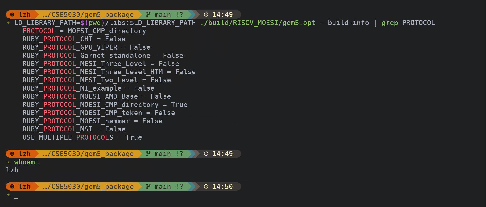
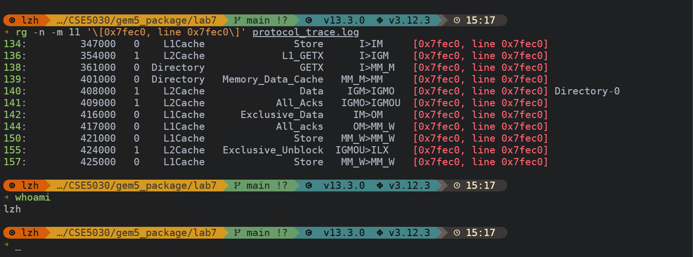
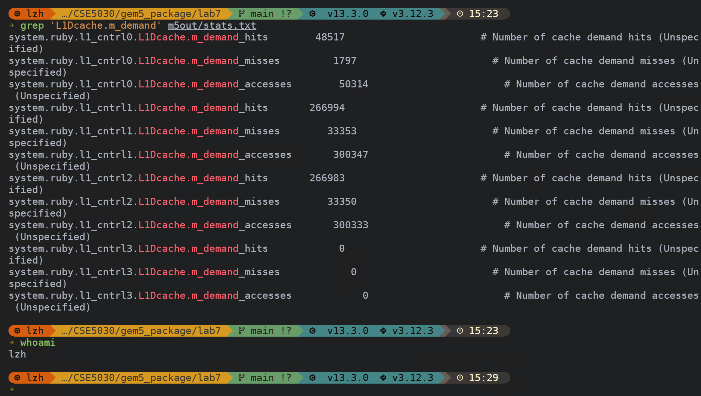
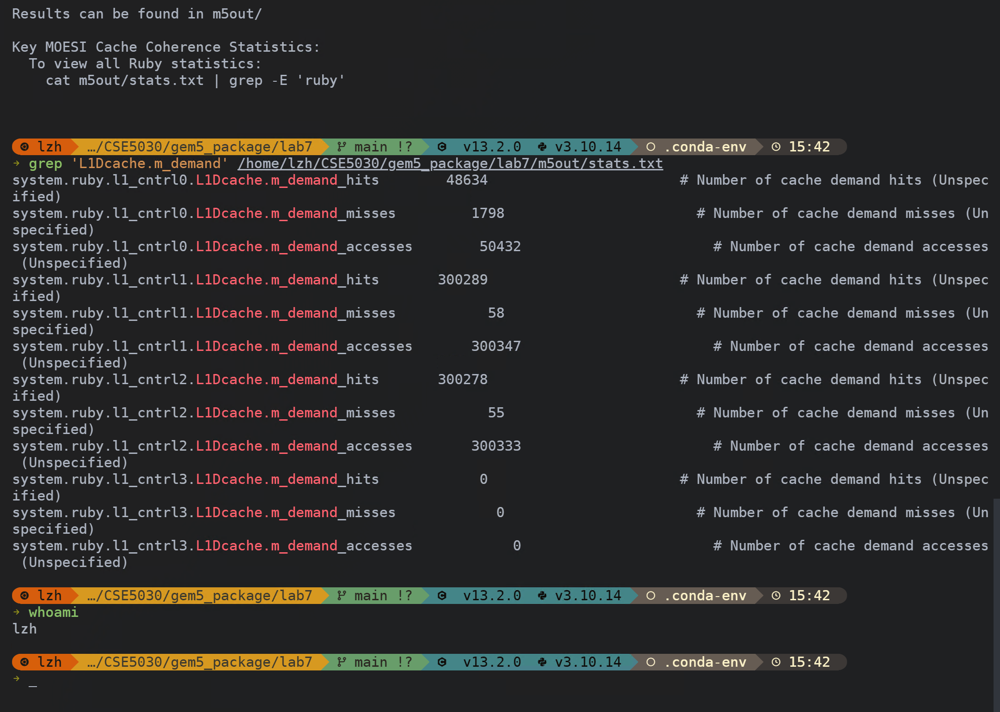

# Lab 7: Cache Coherence Lab

> ID：12532588
> NAME：Li Zihao

## 1. gem5 Installation Verification

### 1.1 Screenshot: `--build-info | grep PROTOCOL` + `whoami` in the same terminal



### 1.2 Verification Result

- `PROTOCOL`：`MOESI_CMP_directory`
- `RUBY_PROTOCOL_MOESI_CMP_directory`：`True`
- `whoami`：`lzh`

## 2. Protocol Trace Analysis

### 2.1 Screenshot: state transitions + `whoami` in the same terminal



### 2.2 Observed State Transitions

- 对地址 `0x7fec0` 的一次 `Store` 操作先在 `L1Cache` 中触发状态转换 `I>IM`，表示该缓存块开始请求写权限。
- 写请求随后在更高层传播为 `L1_GETX` 和 `GETX`，说明系统正在为该 cache line 获取独占所有权。
- 当 `Exclusive_Data` 和 `All_acks` 返回后，该缓存块从 `IM>OM` 再到 `OM>MM_W`，表示该行已经可以被当前核心安全写入。

## 3. False Sharing Analysis

### 3.1 Question a) Why does false sharing occur?

`false sharing` 出现的原因是：多个线程虽然修改的是不同变量，但这些变量物理上落在同一条 `cache line` 中。在本实验的 bad version 里，`counter0` 和 `counter1` 在 `struct BadCounter` 中相邻存放，很可能共享同一条 cache line。由于一致性协议是按 cache line 而不是按单个变量维护状态，所以两个线程的写操作会引发不必要的失效和所有权转移。

### 3.2 Question b) How can false sharing be improved/eliminated?

可以通过让不同线程频繁写入的数据落在不同 cache line 中来改善或消除 `false sharing`。常见方法是在结构体中加入 `padding`，或者使用对齐控制，把每个线程的热点变量分开存放。这样可以减少无意义的 coherence traffic，降低 cache miss 和一致性维护开销。

### 3.3 Question c) How can false sharing be observed in `stats.txt`?

`stats.txt` 不会直接写出“发生了 false sharing”，但可以通过 cache 统计间接观察。做法是比较 bad version 和 good version 的 `L1Dcache.m_demand_hits`、`L1Dcache.m_demand_misses`、`L1Dcache.m_demand_accesses` 以及 miss rate。如果优化后 miss 更少、miss rate 更低，就说明由于 `false sharing` 导致的额外一致性开销下降了。

### 3.4 Optimized Code Snippet

```c
#define CACHE_LINE_SIZE 64

struct CounterSlot {
    _Alignas(CACHE_LINE_SIZE) volatile atomic_int value;
};

struct GoodCounter {
    struct CounterSlot counter0;
    struct CounterSlot counter1;
};

struct GoodCounter *counter = aligned_alloc(CACHE_LINE_SIZE, sizeof(struct GoodCounter));
atomic_init(&counter->counter0.value, 0);
atomic_init(&counter->counter1.value, 0);

if (data->thread_id == 0) {
    atomic_fetch_add(&data->counter->counter0.value, 1);
} else {
    atomic_fetch_add(&data->counter->counter1.value, 1);
}
```

### 3.5 Bad Version Evidence

#### 3.5.1 Screenshot: `L1Dcache.m_demand` + `whoami` in the same terminal



#### 3.5.2 L1D Cache Data

以下数据为 `l1_cntrl0` 到 `l1_cntrl3` 的 `L1Dcache.m_demand_*` 汇总值。

| Metric | Bad Version |
| --- | --- |
| `L1Dcache.m_demand_hits` | `582494` |
| `L1Dcache.m_demand_misses` | `68500` |
| `L1Dcache.m_demand_accesses` | `650994` |
| `L1D miss rate` | `10.52%` |
| `whoami` | `lzh` |

### 3.6 Good Version Evidence

#### 3.6.1 Screenshot: `L1Dcache.m_demand` + `whoami` in the same terminal



#### 3.6.2 L1D Cache Data

以下数据为 `l1_cntrl0` 到 `l1_cntrl3` 的 `L1Dcache.m_demand_*` 汇总值。

| Metric | Good Version |
| --- | --- |
| `L1Dcache.m_demand_hits` | `649201` |
| `L1Dcache.m_demand_misses` | `1911` |
| `L1Dcache.m_demand_accesses` | `651112` |
| `L1D miss rate` | `0.29%` |
| `whoami` | `lzh` |

### 3.7 Data Analysis: Bad Version vs. Good Version

下表中的 bad/good 数据均为所有 `L1Dcache` 控制器统计项的汇总结果。

| Item | Bad Version | Good Version |
| --- | --- | --- |
| `L1Dcache.m_demand_hits` | `582494` | `649201` |
| `L1Dcache.m_demand_misses` | `68500` | `1911` |
| `L1Dcache.m_demand_accesses` | `650994` | `651112` |
| `L1D miss rate` | `10.52%` | `0.29%` |
| Analysis | `false sharing` 导致大量不必要的一致性失效和 cache line 转移，因此 miss 明显更高。 | 通过将两个热点计数器分离到不同 cache line，显著减少了 coherence 开销，miss rate 大幅下降。 |

### 3.8 Analysis of Improvement

优化后的 good version 通过 `padding/alignment` 将两个线程频繁写入的计数器放到不同的 cache line 中，避免了 bad version 中由于共享同一条 cache line 而产生的 `false sharing`。从统计结果看，`L1Dcache.m_demand_misses` 从 `68500` 降到 `1911`，miss rate 从 `10.52%` 降到 `0.29%`，而总访问次数基本保持在同一量级。这说明程序逻辑没有本质变化，但无意义的一致性维护和 cache line 争用显著减少，因此优化是有效的。
